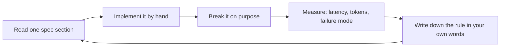

# MCP Mastery

A complete, opinionated path from "I have heard of MCP" to "I am one of the people the
protocol community listens to."

Written for a senior/principal-level AI engineer. Plain words, no hype, every claim
checkable against the spec.

- Target protocol revision: **2026-07-28** (current spec at time of writing)
- Reference SDKs: TypeScript `@modelcontextprotocol/sdk@1.30.0`, Python `mcp` 2.2.0 (needs Python >= 3.10)
- Spec home: https://modelcontextprotocol.io/specification/2026-07-28/index
- Doc index for machines: https://modelcontextprotocol.io/llms.txt

## What MCP is, in one paragraph

MCP (Model Context Protocol) is a JSON-RPC 2.0 wire protocol that lets an AI application
(the **host**) plug into external systems through **servers**. A server exposes three
things: **tools** (things the model can do), **resources** (data the app can read), and
**prompts** (templates the user can pick). MCP is the boring plumbing layer that makes
"give my agent access to X" a config change instead of a custom integration. As of the
2026-07-28 revision it is a **stateless** protocol: every request carries everything the
server needs, so servers scale like ordinary HTTP services.

## What "top 1%" actually means here

Most people who claim MCP skill can wire an SDK example into Claude Desktop. That is the
bottom 60%. The bar that separates the top 1%:

| Signal | Bottom 60% | Top 10% | Top 1% |
| --- | --- | --- | --- |
| Protocol | Uses SDK, never read spec | Read the spec pages they needed | Read `schema.ts`; knows which lines are `MUST` and why |
| Debugging | Prints logs | Uses Inspector | Reads raw JSON-RPC frames, writes their own conformance probes |
| Tool design | One tool per API endpoint | Fewer, task-shaped tools | Measures tool-selection accuracy and token cost, then removes tools |
| Transport | Copies the HTTP example | Knows Streamable HTTP rules | Knows why sessions and SSE resumability were removed, and how to survive proxies |
| Security | Adds a bearer token | Does OAuth 2.1 + PKCE | Audience-binds tokens, blocks confused-deputy and token-passthrough, threat-models `requestState` |
| Versions | Targets one revision | Handles two | Ships one server that serves 2025-06-18, 2025-11-25 and 2026-07-28 clients cleanly |
| Influence | Consumes servers | Publishes a server | Contributes to SDK/spec, authors a SEP, other people's servers follow their patterns |

The roadmap is built to move you across every row of that table.

## How to use this repo

1. Read [`ROADMAP.md`](./ROADMAP.md) once, end to end. It is the plan and the schedule.
2. Work one level at a time from [`roadmap/`](./roadmap). Each level has: plain-word
   concepts, exact spec pages to read, drills, projects, gotchas, and an exit test.
3. Build the projects in [`projects/`](./projects/README.md). They are grouped by **the
   level that unlocks them**, so you always build right after learning the concept. Size
   is a badge: `[S]` half a day to two days, `[M]` one to two weeks, `[L]` capstone.
4. Track yourself in [`PROGRESS.md`](./PROGRESS.md). Do not mark a level done until the
   exit test passes without help.
5. Keep [`reference/`](./reference) open while building. The cheatsheet is the fastest way
   to answer "what is the exact rule here".

**Prefer building first?** Follow the [top-down track](./projects/top-down-track.md):
ship working servers with the SDK inside a real host, then dig into each layer after.
It covers the same levels and projects, in reverse order. Then move to the
[production track](./projects/production-track.md): big LiteLLM + MCP systems with
failure drills.

**Confused about function calling vs tool calling vs MCP?** Read
[`reference/function-calling-vs-mcp.md`](./reference/function-calling-vs-mcp.md) before
anything else.

### The learning loop that actually works



Rules of the loop:

- **Hand-roll before SDK.** For every new concept, send the raw JSON-RPC once. The SDK
  hides exactly the details that interviews and outages are about.
- **Break it on purpose.** Send a request with no `_meta`. Mismatch the protocol header.
  Kill the SSE stream mid-call. A server you have not broken is a server you do not know.
- **Teach it.** One paragraph in your own words per concept. If it takes more than a
  paragraph, you do not understand it yet.

## Repo map

```
mcp-mastery/
  README.md                     you are here
  ROADMAP.md                    the plan: 9 levels, 16 weeks, exit tests
  PROGRESS.md                   personal tracker, one checkbox per skill
  roadmap/
    00-prerequisites.md         JSON-RPC, JSON Schema, tool calling, dev setup
    01-protocol-core.md         stateless core, _meta, server/discover, errors, versions
    02-server-primitives.md     tools, resources, prompts, caching, pagination, completion
    03-transports.md            stdio, Streamable HTTP, subscriptions, progress, cancel
    04-clients-and-hosts.md     host/client design, MRTR, elicitation, Inspector
    05-auth-and-security.md     OAuth 2.1, RFC 8707/9728/9207, attacks and mitigations
    06-production-and-scale.md  deploy, observe, cache, quota, test, publish
    07-extensions-and-frontier.md extensions framework, Tasks, MCP Apps, enterprise auth
    08-mastery-and-influence.md  schema fluency, conformance suites, SEPs, teaching
  projects/                     specs grouped by the level that unlocks them
    README.md                   index: level -> projects, and definition of done
    top-down-track.md           build-first path: T1-T15, small -> medium -> big
    production-track.md         P1-P6: LiteLLM + tokens + sessions + MCP, production drills
    after-l1-foundations.md     S04 bare-metal JSON-RPC, S06 tiny client CLI
    after-l2-primitives.md      S01 hello tools, S02 resources, S03 prompts, M01 DB gateway
    after-l3-transports.md      S05 HTTP deploy, S07 progress/cancel, S08 subscriptions
    after-l4-clients.md         S09 MRTR elicitation, M05 gateway/router
    after-l5-security.md        M02 OAuth server, S10 conformance suite
    after-l6-production.md      M06 production hardening pack
    after-l7-frontier.md        M03 Tasks extension, M04 MCP App
    capstones.md                L01-L05, three to six weeks each
  reference/
    spec-cheatsheet-2026-07-28.md  every wire rule you will forget, in one page
    protocol-eras.md               2024-11-05 to 2026-07-28, what changed and how to support both
    glossary.md                    plain-word definitions
    anti-patterns.md               the mistakes that mark someone as junior
    drills.md                      interview questions, design prompts, review rubric
    function-calling-vs-mcp.md     tool calling vs MCP, and the three meanings of token/session
  builds/                       the implementations, one directory per project
    s04-bare-metal/             S04: zero-dependency 2026-07-28 stdio server + caller + 19 conformance probes
```

## Ground rules for accuracy

The protocol moves fast. Three revisions shipped inside about a year, and 2026-07-28 was a
**breaking** one (no `initialize`, no sessions, no server-initiated requests). So:

- Every rule in this repo links to the spec page it came from. Trust the link, not the prose.
- Before you rely on anything here, re-check https://modelcontextprotocol.io/specification/2026-07-28/changelog
  and the `draft` revision.
- If you find drift between this repo and the spec, fix the repo. That habit alone is a
  top-1% behaviour.

## Start here

Open [`ROADMAP.md`](./ROADMAP.md), then [`roadmap/00-prerequisites.md`](./roadmap/00-prerequisites.md),
then build [`S01`](./projects/after-l2-primitives.md#s01--hello-tools) today. Do not read all nine levels
before writing code.
