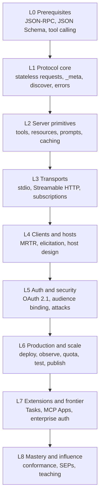

# The MCP Mastery Roadmap

Nine levels. Sixteen weeks at roughly 10 hours a week, or six months at a calmer pace.
Every level has an **exit test**: something you can do without notes. No exit test, no
level completed.

Target revision: **2026-07-28**. Where an older revision matters for compatibility, it is
called out explicitly.

---

## The map

| Level | Name | Time | You can... | Exit test |
| --- | --- | --- | --- | --- |
| [L0](./roadmap/00-prerequisites.md) | Prerequisites | 3-5 days | Speak JSON-RPC and JSON Schema fluently | Write a JSON-RPC request/response pair and a 2020-12 schema by hand, no docs |
| [L1](./roadmap/01-protocol-core.md) | Protocol core | 1 week | Explain the stateless model and version negotiation | Hand-craft `server/discover` + `tools/call` frames over stdio with no SDK |
| [L2](./roadmap/02-server-primitives.md) | Server primitives | 2 weeks | Design tools/resources/prompts that models use well | Ship a server whose tool list a model picks correctly 9/10 times |
| [L3](./roadmap/03-transports.md) | Transports | 1.5 weeks | Run the same server on stdio and Streamable HTTP | Serve a request behind nginx with SSE progress and prove cancellation works |
| [L4](./roadmap/04-clients-and-hosts.md) | Clients and hosts | 2 weeks | Write your own client and host loop | Implement MRTR end to end: `input_required` -> elicit -> retry -> result |
| [L5](./roadmap/05-auth-and-security.md) | Auth and security | 2 weeks | Protect a remote server correctly | Pass your own red-team checklist: audience, `iss`, consent, `requestState` |
| [L6](./roadmap/06-production-and-scale.md) | Production and scale | 2.5 weeks | Operate MCP as a real service | Load-test to a stated SLO, with traces, quotas, and a rollback plan |
| [L7](./roadmap/07-extensions-and-frontier.md) | Extensions and frontier | 1.5 weeks | Use and design extensions | Ship a long job via the Tasks extension plus one interactive MCP App |
| [L8](./roadmap/08-mastery-and-influence.md) | Mastery and influence | ongoing | Shape how others build | A merged upstream contribution and a public conformance suite |

---

## Week-by-week schedule

Assumes ~10 h/week. Compress or stretch freely, but keep the order. Projects are indexed by
the level that unlocks them in [`projects/README.md`](./projects/README.md); each one
assumes the previous level's muscle memory.

| Week | Focus | Build |
| --- | --- | --- |
| 1 | L0 + L1 | [S04 Bare-metal JSON-RPC](./projects/after-l1-foundations.md#s04--bare-metal-json-rpc), [S01 Hello Tools](./projects/after-l2-primitives.md#s01--hello-tools) |
| 2 | L1 finish | [S06 Tiny Client CLI](./projects/after-l1-foundations.md#s06--tiny-client-cli) |
| 3 | L2 tools | [S02 Notes Resources](./projects/after-l2-primitives.md#s02--notes-resources) |
| 4 | L2 resources/prompts | [S03 Prompt Pack](./projects/after-l2-primitives.md#s03--prompt-pack), tool-design review of S01 |
| 5 | L3 transports | [S05 Streamable HTTP Deploy](./projects/after-l3-transports.md#s05--streamable-http-deploy) |
| 6 | L3 streaming | [S07 Progress and Cancel](./projects/after-l3-transports.md#s07--progress-and-cancel), [S08 Watcher](./projects/after-l3-transports.md#s08--subscriptions-watcher) |
| 7 | L4 client side | [S09 MRTR Elicitation](./projects/after-l4-clients.md#s09--mrtr-elicitation) |
| 8 | L4 host design | [M05 Gateway/Router](./projects/after-l4-clients.md#m05--mcp-gatewayrouter) starts |
| 9 | L5 OAuth | [M02 OAuth Remote Server](./projects/after-l5-security.md#m02--oauth-protected-remote-server) |
| 10 | L5 attacks | [S10 Smoke Suite](./projects/after-l5-security.md#s10--server-smoke-suite), red-team pass on M02 |
| 11 | L6 data + safety | [M01 Read-only DB Gateway](./projects/after-l2-primitives.md#m01--read-only-db-gateway) |
| 12 | L6 operate | [M06 Production Hardening Pack](./projects/after-l6-production.md#m06--production-hardening-pack) on M01 + M02 |
| 13 | L7 Tasks | [M03 Long Jobs with Tasks](./projects/after-l7-frontier.md#m03--long-jobs-with-the-tasks-extension) |
| 14 | L7 Apps | [M04 MCP App UI](./projects/after-l7-frontier.md#m04--mcp-app-ui) |
| 15-16 | Pick one large project | [L02 Protocol from Scratch](./projects/capstones.md#l02--protocol-from-scratch) or [L04 SecureMCP](./projects/capstones.md#l04--securemcp) |
| Then | L8, continuous | [L05 Upstream Impact](./projects/capstones.md#l05--upstream-impact) |

Rule: **never more than one large project in flight**, and never a large project before
week 15. Large projects are where mastery is proven, not where it is learned.

---

## Level detail in plain words

### L0 - Prerequisites

MCP invents almost nothing. It is JSON-RPC 2.0 messages, JSON Schema for argument shapes,
plus OAuth for remote access. Learn those three and the protocol becomes small.
Full notes: [`roadmap/00-prerequisites.md`](./roadmap/00-prerequisites.md).

### L1 - Protocol core

The 2026-07-28 revision made MCP **stateless**. There is no `initialize` handshake and no
session id. Every request carries its protocol version and client capabilities inside
`_meta`. Every result carries a `resultType`. Servers must implement `server/discover`.
Get this level right and everything above it is easy.
Full notes: [`roadmap/01-protocol-core.md`](./roadmap/01-protocol-core.md).

### L2 - Server primitives

Three primitives, three owners: **tools** are chosen by the model, **resources** are
chosen by the application, **prompts** are chosen by the user. Most bad MCP servers are
bad because they ignore that split and because they expose one tool per REST endpoint.
This level is where taste is built: naming, granularity, output shape, token cost.
Full notes: [`roadmap/02-server-primitives.md`](./roadmap/02-server-primitives.md).

### L3 - Transports

Two transports: stdio for local processes, Streamable HTTP for everything remote. In
2026-07-28 Streamable HTTP is POST-only, has no GET stream, no session header, and no SSE
resumability. Long-lived change notifications now come from one `subscriptions/listen`
request. Progress and log notifications ride the response stream of the request they
belong to.
Full notes: [`roadmap/03-transports.md`](./roadmap/03-transports.md).

### L4 - Clients and hosts

Servers are the easy half. The hard half is the host: which tools to show the model, how
to cache lists, how to keep the tool budget small, and how to handle a server that says
"I need more input" (**MRTR**). Server-initiated requests are gone; sampling, elicitation
and roots now arrive as `inputRequests` inside a result you must retry.
Full notes: [`roadmap/04-clients-and-hosts.md`](./roadmap/04-clients-and-hosts.md).

### L5 - Auth and security

Remote MCP is OAuth 2.1 with sharp edges: protected resource metadata, PKCE, the
`resource` parameter, audience validation, `iss` validation. Then the MCP-specific
attacks: confused deputy on proxy servers, token passthrough, prompt injection through
resources and tool descriptions, and tampered `requestState`.
Full notes: [`roadmap/05-auth-and-security.md`](./roadmap/05-auth-and-security.md).

### L6 - Production and scale

A stateless protocol means a normal stateless service: horizontal scaling, cache headers
(`ttlMs`, `cacheScope`), quotas per tenant, OpenTelemetry via `traceparent` in `_meta`,
SLOs, load tests, canaries, and a published, versioned package in the MCP registry.
Full notes: [`roadmap/06-production-and-scale.md`](./roadmap/06-production-and-scale.md).

### L7 - Extensions and frontier

The core protocol is deliberately small; growth happens in **extensions** advertised
through capabilities. Learn the official ones: Tasks (long jobs, polling), MCP Apps
(interactive UI in the host), and the auth extensions (client credentials,
enterprise-managed authorization). Then learn when *not* to invent your own.
Full notes: [`roadmap/07-extensions-and-frontier.md`](./roadmap/07-extensions-and-frontier.md).

### L8 - Mastery and influence

Read `schema.ts` end to end. Build a conformance suite that grades any server. Review
other people's servers with a written rubric. Then contribute: SDK fixes, spec issues, a
SEP. Mastery is measured by other people's code changing.
Full notes: [`roadmap/08-mastery-and-influence.md`](./roadmap/08-mastery-and-influence.md).

---

## Skills matrix

Score yourself 0-5 monthly. Top 1% is 4+ on every row and 5 on at least four.

| Skill | 1 (aware) | 3 (competent) | 5 (authority) |
| --- | --- | --- | --- |
| Wire protocol | Knows MCP is JSON-RPC | Reads frames, debugs by eye | Quotes `MUST`s and their rationale; spots spec violations in the wild |
| Tool design | Wraps APIs | Task-shaped tools with good schemas | Has measured tool-selection accuracy and cut tools to raise it |
| Resources/prompts | Knows they exist | Uses templates, pagination, cache hints | Designs resource URI schemes others copy |
| Transports | Runs stdio example | Deploys Streamable HTTP correctly | Handles proxies, keep-alives, cancellation, multi-era clients |
| Client/host | Uses Claude Desktop | Wrote a client | Wrote a host with tool routing, caching and budgets |
| MRTR | Heard of it | Implemented one round trip | Signs and expiry-binds `requestState`; handles repeated rounds |
| Auth | Adds a token | Full OAuth 2.1 + PRM + PKCE | Audience-binds, validates `iss`, defeats confused deputy |
| Security | Sanitizes input | Threat-models a server | Publishes a red-team suite and mitigations |
| Operations | Runs locally | Deployed with logs | SLOs, traces, quotas, canary, incident runbook |
| Compatibility | One revision | Two revisions | One codebase across eras with tests per era |
| Influence | Reads docs | Published a server | Merged upstream change or authored SEP |

---

## Milestones worth putting on a resume

1. **Week 4** - a public MCP server with a hand-written tool-design rationale.
2. **Week 8** - a working MCP client and gateway you wrote yourself, no SDK on the client path.
3. **Week 10** - a security report on your own server with fixes, written like a real audit.
4. **Week 12** - a server in the MCP registry with CI, versioning, and a deprecation note.
5. **Week 16** - one large project shipped and written up.
6. **Ongoing** - a merged upstream contribution, then a SEP.

---

## How to stay current after week 16

- Watch the `draft` spec, not just the current revision:
  https://modelcontextprotocol.io/specification/draft/changelog
- Read every new SEP index entry: https://modelcontextprotocol.io/seps/index
- Track the feature lifecycle registry, since features now get a 12-month deprecation
  window: https://modelcontextprotocol.io/specification/2026-07-28/deprecated
- Re-run your conformance suite against your servers on every SDK bump.
- One hour a week reading other people's servers. Taste is copied, not derived.
