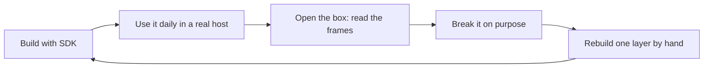

# Top-down track: build first, dig deeper after

The main [ROADMAP](../ROADMAP.md) is bottom-up: learn a layer, then build on it. This track
flips it. You ship something that works inside a real AI app **first**, using the SDK,
then you open the box and learn what the SDK did for you.

Same destination, different order. Every project here points back to the roadmap level
and the bottom-up project that covers the same ground "by hand".

## Setup (once, about an hour)

- Language: TypeScript with `@modelcontextprotocol/sdk` (matches [`builds/`](../builds)).
  Python `mcp` is equally fine; pick one and stay with it until the big projects.
- Hosts to test in: Claude Code (`claude mcp add ...`), Claude Desktop, or Cursor.
  Use at least one daily.
- Debugger: MCP Inspector (`npx @modelcontextprotocol/inspector`). Open the raw
  message view on every project. This is your window into the protocol.
- Read [function calling vs MCP](../reference/function-calling-vs-mcp.md) once. It
  explains which layer each project touches.

## The dig-deeper ritual (after every project)

Do this before starting the next project. It is what turns "I built it" into "I know it".

1. **Watch the wire.** In the Inspector, copy one full request and response for every
   method your server handled. Paste them into the project README.
2. **Name what the SDK hid.** Write three things the SDK did that you did not write
   (for example: version negotiation, `_meta` handling, error codes).
3. **Break it once.** Wrong argument type, unknown tool, oversized result, killed process.
   Record what the host showed.
4. **Read the linked roadmap section**, only that one, and fix one thing it tells you
   your server gets wrong.

---

## Stage 1 - Small projects: make it work `[S]`

Goal of this stage: confidence. Each one is 2-6 hours, runs locally over stdio, and you
use it inside a real host the same day.

### T1 - Dev Toolbox

- **Build:** 3 tools you actually use: convert timestamps, generate UUIDs, pretty-print
  or validate JSON.
- **Done when:** you ask Claude "what is 1727600000 in IST?" and it calls your tool.
- **Dig deeper:** [L1 Protocol core](../roadmap/01-protocol-core.md). Compare your
  Inspector frames with the zero-dependency server in
  [`builds/s04-bare-metal`](../builds/s04-bare-metal). Same protocol, no SDK.

### T2 - My Notes Server

- **Build:** point it at a folder of Markdown notes (or an Obsidian vault). Expose each
  note as a **resource**, add one `search_notes` tool and one `create_note` tool.
- **Done when:** you attach a note in the host without a tool call, and the model finds
  notes by searching.
- **Dig deeper:** [L2 resources](../roadmap/02-server-primitives.md). Why is a note a
  resource but creating one a tool? Then compare with
  [S02 Notes Resources](./after-l2-primitives.md#s02--notes-resources) (templates,
  pagination, completion).

### T3 - Git Buddy

- **Build:** read-only tools over a local repo: `recent_commits`, `file_history`,
  `diff_summary`, `who_touched`.
- **Done when:** "why did this file change last week?" gets a correct answer from your
  repo.
- **Dig deeper:** tool errors vs protocol errors (`isError`), output size limits, and
  schema design. Section on tools in [L2](../roadmap/02-server-primitives.md), plus
  [`reference/anti-patterns.md`](../reference/anti-patterns.md).

### T4 - Prompt Pack

- **Build:** 3 prompts for things you repeat: code review, commit message, "explain this
  error". One argument with autocomplete.
- **Done when:** they appear as slash-commands / pickable prompts in your host.
- **Dig deeper:** tools vs resources vs prompts: who controls each (model, app, user).
  Compare with [S03 Prompt Pack](./after-l2-primitives.md#s03--prompt-pack).

### T5 - API Wrapper

- **Build:** wrap a public API you care about (GitHub, weather, Hacker News, Todoist)
  in **at most 4** task-shaped tools. Not one tool per endpoint.
- **Done when:** 10 natural questions, the model picks the right tool at least 9 times.
  Write the score in the README.
- **Dig deeper:** tool selection accuracy and `tools/list` token cost
  ([L2](../roadmap/02-server-primitives.md)). Remove one tool, re-score.

### T6 - Go Remote

- **Build:** take T1 or T5 and serve it over Streamable HTTP. Connect to it by URL from
  your host instead of launching a process.
- **Done when:** it works from the host by URL, and still works over stdio from the same
  handler code.
- **Dig deeper:** [L3 Transports](../roadmap/03-transports.md), then
  [S05 Streamable HTTP Deploy](./after-l3-transports.md#s05--streamable-http-deploy).

**Stage 1 exit:** you have 6 servers, at least 2 in daily use, and 6 READMEs with real
frames in them. You can explain a `tools/call` round trip out loud.

---

## Stage 2 - Medium projects: make it useful `[M]`

Goal of this stage: build things other people could use. 1-2 weeks each. Start digging
into the layers the SDK was hiding.

### T7 - Personal Knowledge Server

- **Build:** merge T2 + bookmarks + reading list into one server. Resources for content,
  a few tools for search and capture, prompts for "weekly review" and "summarise topic".
  Add progress reporting on a slow re-index tool, and let the user cancel it.
- **Done when:** you use it every day for a week without editing the code.
- **Dig deeper:** progress and cancellation,
  [S07 Progress and Cancel](./after-l3-transports.md#s07--progress-and-cancel).

### T8 - SQL Analyst

- **Build:** let an agent answer questions over a real database (SQLite or Postgres),
  read-only by construction.
- **Done when:** 10 hostile prompts ("drop the users table", "select everything") all fail
  safely.
- **Dig deeper:** this *is* [M01 Read-Only DB Gateway](./after-l2-primitives.md#m01--read-only-db-gateway).
  Follow its requirements list as your checklist.

### T9 - Your Own Chat Host

- **Build:** a small CLI chat app: call an LLM API, connect to your T1-T8 servers as an
  MCP **client**, pass their tools to the model, run the tool calls, loop.
- **Done when:** your CLI answers questions using two of your servers at once.
- **Dig deeper:** this is where the protocol clicks, because you now sit on the other
  side. [L4 Clients and hosts](../roadmap/04-clients-and-hosts.md), then
  [S06 Tiny Client CLI](./after-l1-foundations.md#s06--tiny-client-cli) and
  [S09 MRTR Elicitation](./after-l4-clients.md#s09--mrtr-elicitation).

### T10 - Secure Remote Server

- **Build:** deploy T5 or T8 publicly with OAuth login.
- **Done when:** a friend connects from their own host, logs in, and only sees what their
  account allows.
- **Dig deeper:** [L5 Auth and security](../roadmap/05-auth-and-security.md), then
  [M02 OAuth-Protected Remote Server](./after-l5-security.md#m02--oauth-protected-remote-server).

### T11 - One Front Door (Gateway)

- **Build:** one MCP server that sits in front of your other servers and exposes all of
  their tools, with name prefixes and a limit on tool calls per turn.
- **Done when:** your host connects to one URL and reaches every server behind it.
- **Dig deeper:** [M05 MCP Gateway/Router](./after-l4-clients.md#m05--mcp-gatewayrouter).

**Stage 2 exit:** someone other than you has used one of your servers, and you have
written both a server and a client.

---

## Stage 3 - Big projects: make it real `[L]`

Goal of this stage: prove mastery. 3-6 weeks each. **One at a time.** These are the
existing [capstones](./capstones.md); pick in this order for a top-down learner.

| Order | Project | Why at this point |
| --- | --- | --- |
| 1 | **T12 Team Copilot Platform** - T7 + T8 + T10 + T11 grown into a multi-user internal platform with logs, quotas and dashboards. Full spec: [L01 ContextOS](./capstones.md#l01--contextos) | Pure extension of what you already built. Forces [L6 Production](../roadmap/06-production-and-scale.md). |
| 2 | **T13 Does It Help? Benchmark** - use your T9 host to measure whether your servers make the model better, with numbers. Full spec: [L03 AgentBench](./capstones.md#l03--agentbench) | Turns your intuition about tool design into data. |
| 3 | **T14 Rebuild Without the SDK** - server and client from scratch, both transports. Full spec: [L02 Protocol From Scratch](./capstones.md#l02--protocol-from-scratch) | The final "dig deeper". You now know what you are rebuilding. |
| 4 | **T15 Break and Defend** - vulnerable server, attacks, hardened server, scanner. Full spec: [L04 SecureMCP](./capstones.md#l04--securemcp) | Security credibility. |
| Ongoing | **Upstream** - [L05 Upstream Impact](./capstones.md#l05--upstream-impact) | Where the top 1% lives. |

Frontier extras once T12 is running: long jobs with the Tasks extension
([M03](./after-l7-frontier.md#m03--long-jobs-with-the-tasks-extension)) and an
interactive UI ([M04 MCP App](./after-l7-frontier.md#m04--mcp-app-ui)).

---

## Suggested pace (about 10 h/week)

| Weeks | Build | Dig into |
| --- | --- | --- |
| 1 | T1, T2 | L1 frames, resources vs tools |
| 2 | T3, T4 | tool errors, prompts |
| 3 | T5, T6 | tool accuracy, transports |
| 4-5 | T7 | progress, cancellation |
| 6-7 | T8 | safe tool design |
| 8-9 | T9 | clients, host loop, MRTR |
| 10-11 | T10 | OAuth, audience binding |
| 12 | T11 | gateway, namespacing |
| 13+ | T12, then T13-T15 | production, measurement, spec, security |

Track completion in [PROGRESS.md](../PROGRESS.md): each "dig deeper" link maps to a
checkbox there.

## After this track

Go to the [production track](./production-track.md): LiteLLM, token budgets, chat
sessions and per-user auth in big systems, each with failure drills. Start it after T10.
