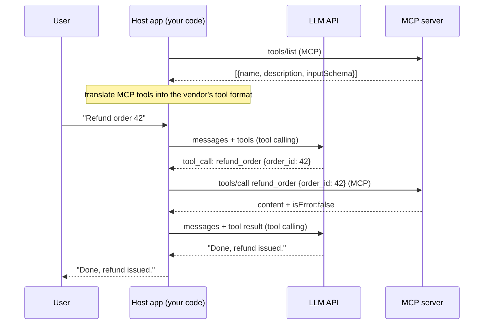
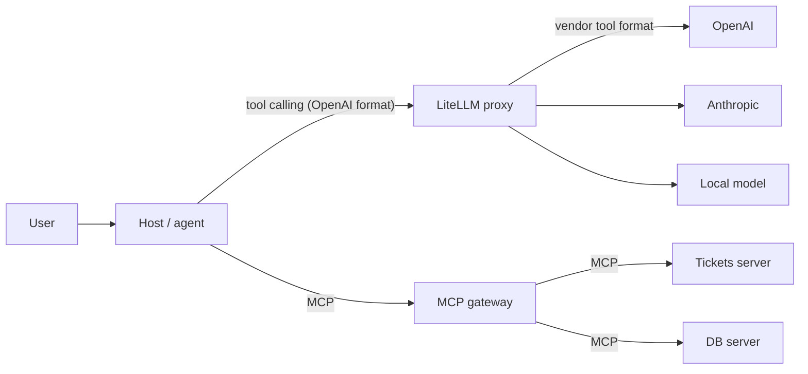

# Function calling vs tool calling vs MCP

The short answer:

- **Function calling** and **tool calling** are the same thing. OpenAI first called it
  "function calling" and later renamed the API field to `tools`. Anthropic calls it "tool
  use". Different vendor names for one idea.
- **MCP** is a different layer. It does not replace tool calling. It feeds it.

| | Tool calling (a.k.a. function calling) | MCP |
| --- | --- | --- |
| Is a... | Model capability + LLM API format | Wire protocol (JSON-RPC 2.0) |
| Conversation between | **Your app <-> the model** | **Your app <-> a tool provider (server)** |
| Answers the question | "Which function should run, with which arguments?" | "Which tools exist, and how do I run them?" |
| Defined by | Each LLM vendor (formats differ) | One open spec, same for every vendor |
| Who runs the code | Your app, always. The model never executes anything | The MCP server |
| Does the model see it? | Yes, tool definitions go into the prompt | **No.** The model never sees MCP frames |
| Covers | Tools only | Tools, resources, prompts, auth, transports, caching, progress |
| Where tools live | Hard-coded in your app | In separate servers, reusable by any MCP host |

One sentence to remember: **tool calling is how the model asks; MCP is how your app finds
and runs what the model asked for.**

---

## The full loop, with both layers visible



The **host** sits in the middle and speaks two languages: the vendor's tool-calling format
to the model, and MCP to the server. That translation is the whole trick.

---

## Same tool, three formats

What the MCP server returns from `tools/list` (one entry):

```json
{
  "name": "refund_order",
  "description": "Refund a paid order. Fails if already refunded.",
  "inputSchema": {
    "type": "object",
    "properties": { "order_id": { "type": "integer" } },
    "required": ["order_id"],
    "additionalProperties": false
  }
}
```

What your host sends to **OpenAI** (Chat Completions):

```json
{ "type": "function",
  "function": { "name": "refund_order", "description": "...", "parameters": { "...same schema..." } } }
```

The model replies with `tool_calls: [{ "id": "call_1", "type": "function", "function": {
"name": "refund_order", "arguments": "{\"order_id\":42}" } }]`. Note: `arguments` is a
**JSON string**, not an object. You answer with a message `{ "role": "tool",
"tool_call_id": "call_1", "content": "..." }`.

What your host sends to **Anthropic** (Messages API):

```json
{ "name": "refund_order", "description": "...", "input_schema": { "...same schema..." } }
```

The model replies with a content block `{ "type": "tool_use", "id": "toolu_1", "name":
"refund_order", "input": { "order_id": 42 } }`. You answer with `{ "type": "tool_result",
"tool_use_id": "toolu_1", "content": "..." }`.

What your host then sends to the **MCP server** (2026-07-28):

```json
{ "jsonrpc": "2.0", "id": 7, "method": "tools/call",
  "params": {
    "name": "refund_order",
    "arguments": { "order_id": 42 },
    "_meta": {
      "io.modelcontextprotocol/protocolVersion": "2026-07-28",
      "io.modelcontextprotocol/clientCapabilities": {}
    } } }
```

Notice: the **schema is identical** in all three. Only the envelope changes. The `id`
the model gave (`call_1`, `toolu_1`) is a tool-calling id; the JSON-RPC `id: 7` is an MCP
id. They are unrelated; do not mix them.

The host-side adapter is small:

```ts
// MCP tool -> OpenAI tool
const toOpenAI = (t) => ({ type: "function",
  function: { name: t.name, description: t.description, parameters: t.inputSchema } });

// MCP tool -> Anthropic tool
const toAnthropic = (t) => ({ name: t.name, description: t.description, input_schema: t.inputSchema });
```

This is exactly what you build in [T9 Your Own Chat Host](../projects/top-down-track.md#t9---your-own-chat-host).

---

## When you do NOT need MCP

Plain tool calling is enough when:

- One app, one team, and the functions are private to that app.
- No other AI host will ever reuse the tools.
- No separate auth boundary between the app and the tool.

Reach for MCP when:

- The same tools should work in Claude Desktop, Cursor, your own agent, and a teammate's.
- Another team owns the system (tickets, billing, data) and should own its tools.
- The tools are remote and need real auth (OAuth, per-user permissions).
- You want resources and prompts too, not only functions.

Rule of thumb: **tool calling is an API feature; MCP is an integration architecture.**

---

## Where the lines blur (and why people get confused)

1. **Provider-side MCP connectors.** Some LLM APIs can call a remote MCP server for you:
   OpenAI's [remote MCP tool](https://platform.openai.com/docs/guides/tools-remote-mcp)
   in the Responses API and Anthropic's
   [MCP connector](https://docs.anthropic.com/en/docs/agents-and-tools/mcp-connector).
   The vendor runs the MCP client inside their infrastructure. It is still MCP; it just
   moved from your host into theirs. You give up control of budgets, logging and
   confirmation prompts in exchange for less code.
2. **LiteLLM.** [LiteLLM](https://docs.litellm.ai/docs/) normalises tool calling across
   100+ model providers into the OpenAI format, so your host writes one adapter instead of
   many. Its proxy also has an [MCP Gateway](https://docs.litellm.ai/docs/mcp): one
   endpoint in front of many MCP servers, with access controlled per key and team. So
   LiteLLM touches **both** layers, which is useful and also confusing.
3. **Agent frameworks** (LangChain, OpenAI Agents SDK, etc.) hide both layers behind one
   `tools=[...]` list. Great for shipping, bad for learning. Open the box once with
   your own host first.



---

## "Token" and "session": three meanings each

This is the second big source of confusion. In production code all six show up in the
same request, so name them precisely.

### Token

| Meaning | What it is | Where it lives | Goes wrong when |
| --- | --- | --- | --- |
| **LLM token** | Unit of text the model reads/writes. Drives cost, latency and context-window limit | Counted per request by the LLM API / LiteLLM | Context overflows, bill spikes, a tool result eats the window |
| **Auth token** | OAuth access token proving *who* is calling an MCP server, bound to that server's audience | Issued by an authorization server, sent as `Authorization: Bearer` | Passed through to another service, not audience-checked, expires mid-run |
| **API key / virtual key** | Credential for calling the LLM (for example a LiteLLM virtual key with its own budget) | Your secrets store / LiteLLM DB | Shared across teams, no budget, leaked in logs |

(MCP also has a `progressToken`: just an id that links progress notifications to a
request. Not a credential, not a text unit.)

### Session

| Meaning | What it is | Who owns it | Key fact |
| --- | --- | --- | --- |
| **Chat session** | The conversation history for one user thread | **Your host app** (Redis/Postgres) | The model is stateless. You resend the history (or a summary of it) every turn. That is why long chats get expensive |
| **MCP session** | Connection-level state between client and server (`Mcp-Session-Id` header) | Nobody, in 2026-07-28 | Existed from 2025-03-26 to 2025-11-25; **removed** in 2026-07-28. Continuation state now rides in signed `requestState` or server-minted handles. See [protocol-eras.md](./protocol-eras.md) |
| **Login session** | The user's authenticated identity in your web/Slack app, often with a refresh token | Your app's auth layer | One chat session can outlive one access token; one Slack thread can contain several users |

Production rule: **these are three separate stores with three separate lifetimes.**
Chat history in one place, credentials in another, and MCP carrying none of it between
requests. Most real outages in agent systems are one of these leaking into another:
the wrong user's token used inside a shared chat session, a chat session that silently
grows past the context window, or a server that assumed an MCP session would remember
the user.

---

## Check yourself

1. The model said "call `refund_order`". Which process actually runs the refund, and over
   which protocol?
2. You switch from OpenAI to Anthropic. What changes in your MCP server? (Answer: nothing.)
3. Where does the conversation history live in a 2026-07-28 MCP system? (Answer: in the
   host, never in the MCP server.)
4. A user's OAuth token expires on turn 14 of a 30-turn chat. Which of the six
   "token/session" things is affected, and which are not?
5. Why can't you just forward the user's LiteLLM virtual key to an MCP server as its auth
   token?

Related: [roadmap/00 section 3](../roadmap/00-prerequisites.md#3-the-tool-calling-mental-model),
[roadmap/04 clients and hosts](../roadmap/04-clients-and-hosts.md),
[roadmap/05 auth](../roadmap/05-auth-and-security.md).
